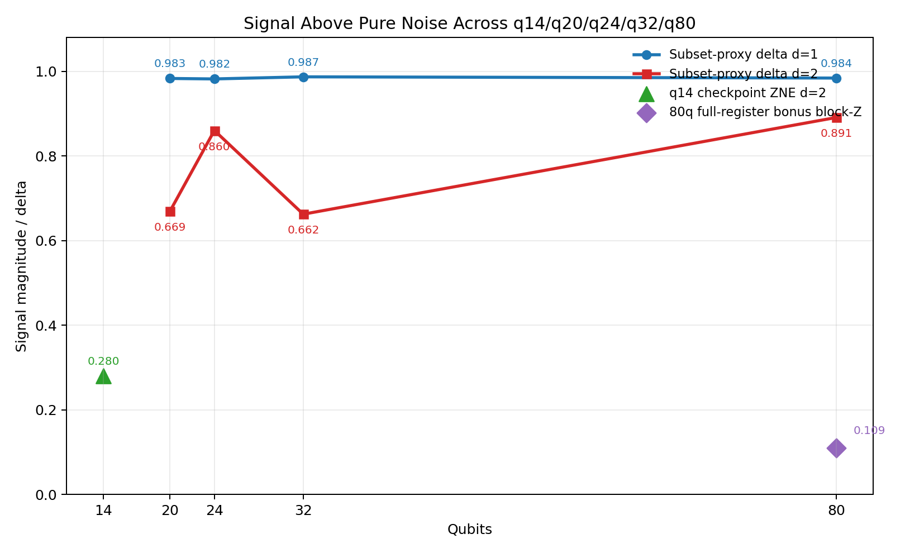

# Echo, Scrambling, and the Black-Hole Information Story on 80 Qubits

Stephen Hawking made the black-hole information problem famous: if black holes radiate, what happens to the information that falls in? The modern quantum-information answer is usually not "the information is destroyed," but "the information gets scrambled." It becomes hard to recover locally because it is spread over many degrees of freedom.

This repository studies a hardware-accessible version of that story. The core question is: if we disturb one qubit locally and run an echo-style circuit, does the response stay local, or does it spread in a structured way across the system?

The short answer from the current hardware snapshot is: yes, a real locality-sensitive echo signal survives all the way to 80 qubits.

## What the picture shows

The plot is a staged evidence ladder from q14 to q80.

- The blue and red lines are the main scale-up result: subset-proxy locality signals at q20, q24, q32, and q80.
- The green q14 point is a stricter checkpoint-level hardware anchor.
- The purple q80 point is a harder full-register bonus observable based on mirrored block-Z response.

The important message is not that all points are the same observable. They are not. The message is that the signal does not disappear as the system gets larger, and that even the stricter 80-qubit full-register bonus analysis still shows structured residual locality rather than pure noise.

## The 80-qubit result

The cleanest current 80-qubit result is a first subset pilot on `S_A = 0..9`, comparing an overlap perturbation at `q=0` to a far-disjoint perturbation at `q=79`.

- Depth 1 subset contrast: `q79 - q0 = +0.98420`
- Depth 2 subset contrast: `q79 - q0 = +0.89110`

That means the measured subset is strongly affected when the perturbation overlaps it, and stays largely clean when the perturbation is moved far away. This is exactly the kind of support-sensitive behavior you want if information is spreading in a structured way rather than just washing out as generic noise.

We also ran a harder exploratory 80-qubit full-register bonus analysis. The global full-register echo was fragile, so the stronger fallback was a mirrored block-Z observable on the same paired capture. That smaller marker is still positive at `0.10932`, and the front/back block pattern has the right sign structure: perturbations near the left end mainly suppress the left block, and perturbations near the right end mainly suppress the right block.

## Why this connects to Hawking's story

This repo does not claim to simulate an actual astrophysical black hole. The connection is conceptual and physical:

- local information starts in one place
- under scrambling dynamics it spreads across the system
- local recovery becomes harder
- the information is not literally gone, but it is no longer locally readable

That is the same basic logic that makes the black-hole information problem so interesting. In that sense, this project is about a real physics process, not just a benchmark score. The hardware is being used to probe a locality-sensitive many-body echo response that fits the broader scrambling picture.

## What is and is not claimed

What this repo supports now:

- strong subset-level locality evidence from q20 through q80
- a successful first 80-qubit subset pilot
- an exploratory 80-qubit full-register bonus signal that remains structured above a pure-noise reading

What this repo does not claim:

- a literal black-hole experiment
- full 80-qubit fixed-observable OLE closure on hardware
- a single uniform observable family across every point in the plot

## Where to start

- Technical basis note: [signal_scale_technical_note_2026-03-21.md](files/quantum-math-lab/results/hardware/summary/signal_scale_technical_note_2026-03-21.md)
- Current paper draft PDF: [paper/build/main.pdf](paper/build/main.pdf)
- Current paper source: [paper/main.tex](paper/main.tex)
- q80 scope boundary: [.gpd/research/Q80_SCOPE.md](.gpd/research/Q80_SCOPE.md)
- Cross-scale data snapshot: [signal_above_noise_scale_plot_2026-03-21.json](files/quantum-math-lab/results/hardware/summary/signal_above_noise_scale_plot_2026-03-21.json)
- 80q block-Z bonus artifact: [full_q80_q0_q79_paired_t5_blockz_front10_back10.json](files/quantum-math-lab/results/hardware/bonus_full_q80_2026-03-21/depth2_paired_blockz_reuse/full_q80_q0_q79_paired_t5_blockz_front10_back10.json)

## One-sentence summary

This repository tracks a staged hardware result in which a locality-sensitive echo signal remains visible from q14 up to an 80-qubit pilot, offering a concrete many-body scrambling use case with a clear conceptual link to the black-hole information story.
